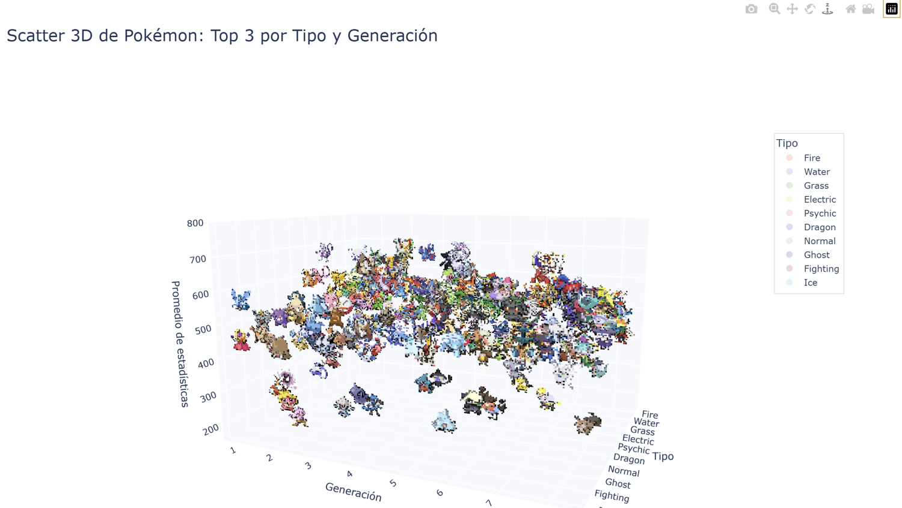
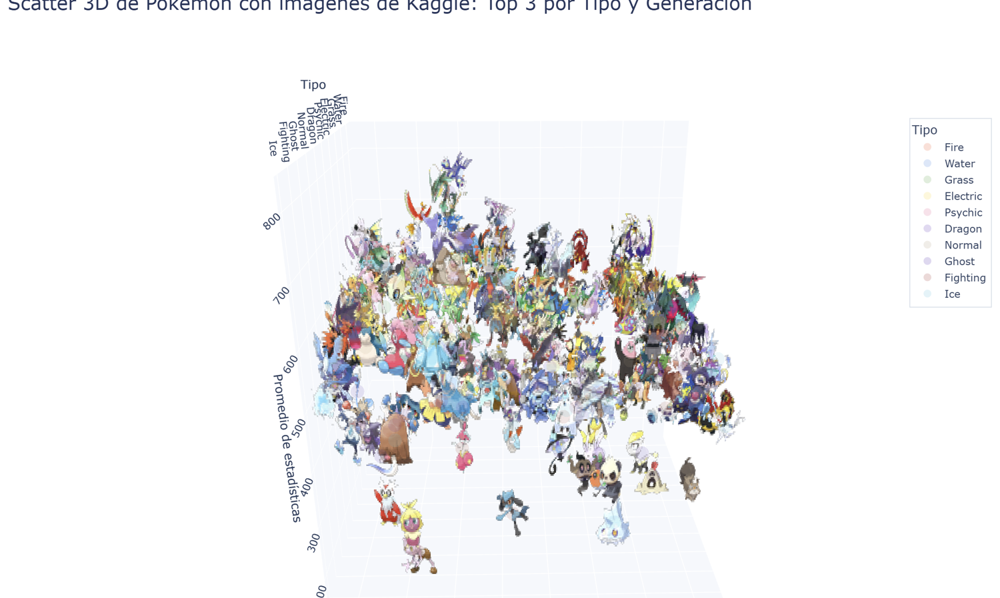
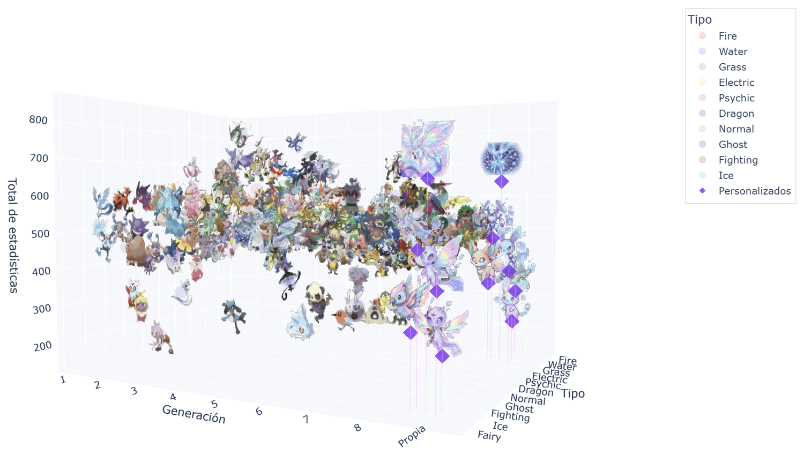
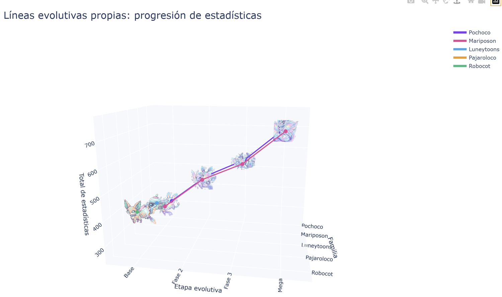

# Pokémon 3D — Visualización de estadísticas con sprites

Notebook de análisis y visualización que grafica el **total de estadísticas base** de los
Pokémon en un espacio tridimensional, usando los **sprites reales como puntos del gráfico**
en lugar de marcadores. Incluye además **11 Pokémon de creación propia** integrados al
mismo dataset.

| Eje | Variable |
|-----|----------|
| **X** | Generación (1 – 8, más la generación *Propia*) |
| **Y** | Tipo principal |
| **Z** | Total de estadísticas base (HP + Ataque + Defensa + At. Esp. + Def. Esp. + Velocidad) |

---

## Contenido del repositorio

```
practica10/
├── pokemones.ipynb              # Notebook principal (50 celdas)
├── README.md
├── imagenes/                    # Capturas de los resultados
├── pokemon_personalizados/      # Sprites propios (11 PNG con fondo transparente)
├── sprites_pokemon/             # Caché de sprites descargados de PokéAPI (se genera solo)
└── pokemon_pokeapi_cache.csv    # Caché de datos de PokéAPI (se genera solo)
```

---

## Requisitos

```bash
pip install pandas numpy matplotlib plotly pillow requests kagglehub nbformat ipympl
```

- **Python 3.10+** (el notebook se desarrolló sobre 3.13).
- Conexión a internet en la primera ejecución: se descargan los datos de PokéAPI y el
  dataset de imágenes de Kaggle. Después todo queda en caché local.
- Para el dataset de Kaggle se necesita una cuenta y las credenciales de `kagglehub`
  (`~/.kaggle/kaggle.json`).

---

## Fuentes de datos

| Fuente | Qué aporta | Dónde se usa |
|--------|-----------|--------------|
| [PokéAPI](https://pokeapi.co) | ID, nombre, tipos, 6 estadísticas base, sprite oficial | Celdas 29 – 41 |
| [Kaggle — Complete Pokémon Library (32k imágenes)](https://www.kaggle.com/datasets/divyanshusingh369/complete-pokemon-library-32k-images-and-csv) | Imágenes en alta resolución y CSV con stats | Celdas 4 – 27, 42 – 43 |
| `KeithGalli/pandas` — `pokemon_data.csv` | Dataset clásico de stats por generación | Celdas 5 – 21 |
| `fanzeyi/pokemon.json` — `pokedex.json` | Pokédex con stats en JSON | Celda 29 |
| **Creaciones propias** | 11 Pokémon diseñados a mano | Celdas 45 – 49 |

La generación no viene en todos los datasets, así que se deriva del ID de Pokédex
(1‑151 → Gen 1, 152‑251 → Gen 2, etc.) mediante la función `obtener_generacion()`.

---

## Recorrido por el notebook

El notebook es iterativo: cada bloque es un intento distinto de resolver el mismo problema
—cómo poner imágenes como puntos en un espacio 3D— y cada versión mejora a la anterior.

### Bloque 1 · Matplotlib con `AnnotationBbox3D` (celdas 0 – 21)

Primera aproximación. Se descarga el CSV clásico de stats, se normalizan nombres para
emparejarlos con las imágenes de Kaggle (`normalizar_nombre()` + `score_imagen()` para
elegir la mejor imagen de cada carpeta), y se calcula **un representante por tipo y
generación**: el Pokémon cuyo total está más cerca del promedio de su grupo.

La clase `AnnotationBbox3D` extiende `AnnotationBbox` y reproyecta la imagen en cada
`draw()` usando `proj3d.proj_transform()`, para que el sprite siga la coordenada 3D al rotar.

### Bloque 2 · Plotly con profundidad simulada (celdas 22 – 27)

Un gráfico 2D que **finge ser 3D**: la posición del tipo se convierte en un desplazamiento
diagonal (`PROFUNDIDAD_X`, `PROFUNDIDAD_Y`) sobre un `go.Scatter` normal. Las imágenes se
insertan como `layout_image` codificadas en base64 y se agregan puntos invisibles para
capturar el hover. Funciona, pero no se puede rotar.

### Bloque 3 · Matplotlib interactivo con ipympl (celdas 28 – 37)

Se cambia la fuente de datos a PokéAPI con caché en CSV (`pokemon_pokeapi_cache.csv`) para
no volver a descargar 898 Pokémon en cada ejecución. Se usa `%matplotlib widget` para poder
rotar la figura.

### Bloque 4 · Matplotlib estático en "figure pixels" (celdas 38 – 39)

Solución al problema de que los sprites no se colocaban bien en VS Code: en lugar de anclar
la imagen a coordenadas de datos, se proyecta la coordenada 3D a píxeles de pantalla
(`ax.transData.transform()`) y se dibuja el `AnnotationBbox` con `xycoords="figure pixels"`.
El `zorder` se calcula a partir de la profundidad para que los sprites cercanos tapen a los
lejanos. Exporta un PNG de alta resolución.

### Bloque 5 · Plotly 3D real con `Mesh3d` (celdas 40 – 41)

**Esta es la técnica definitiva.** Plotly no permite insertar imágenes dentro de una escena
3D, así que cada sprite se **convierte en geometría**: por cada píxel no transparente se
generan 4 vértices y 2 triángulos, y el color del píxel se asigna como `facecolor`. La
iluminación se anula (`ambient=1, diffuse=0`) para que los colores salgan planos y fieles.

El resultado es un plano texturizado por Pokémon dentro de una escena 3D totalmente
rotable, con `Scatter3d` casi transparentes encima que proveen el hover con nombre, tipo,
generación y stats.



### Bloque 6 · Plotly 3D con imágenes de Kaggle (celdas 42 – 43)

Misma técnica de `Mesh3d`, pero con las ilustraciones en alta resolución de Kaggle en lugar
de los sprites pixelados. Añade limpieza de imagen: eliminación de fondo casi blanco,
recorte de bordes transparentes y realce de nitidez, contraste y saturación con
`ImageEnhance`. Une el CSV de Kaggle con PokéAPI mediante doble merge (nombre exacto y
nombre base, para que *Mega Charizard X* encuentre a *Charizard*).



### Bloque 7 · Pokémon personalizados (celdas 44 – 49)

Sección final que integra las creaciones propias al mismo pipeline.

| Celda | Contenido |
|-------|-----------|
| **11.A** | Registro de los 11 Pokémon con sus 6 estadísticas base, tipos, familia y etapa |
| **11.B** | `integrar_personalizados()` — une el dataset oficial con los propios en `df_pokemon_total` |
| **11.C** | Scatter 3D de Plotly con todo junto |
| **11.D** | Versión matplotlib estática, exporta PNG |
| **11.E** | Gráfico 3D de las líneas evolutivas |

---

## Los Pokémon personalizados

Once criaturas propias, ubicadas en la **generación 9 ("Propia")**. Para alojarlas se
agregó el tipo **Fairy** al eje Y, que no estaba en la lista original de 10 tipos.

| Pokémon | Familia | Etapa | Tipos | Total |
|---------|---------|-------|-------|-------|
| Pochoco | Pochoco | Base | Electric / Psychic | 320 |
| Pochotron | Pochoco | Fase 2 | Electric / Psychic | 460 |
| Pocholord | Pochoco | Fase 3 | Electric / Steel | 545 |
| Mega Pocholord | Pochoco | Mega | Electric / Steel | 700 |
| Mariposon | Mariposon | Base | Fairy / Ice | 330 |
| Maripopon | Mariposon | Fase 2 | Fairy / Ice | 470 |
| Maripolord | Mariposon | Fase 3 | Fairy / Ice | 550 |
| Mega Maripolord | Mariposon | Mega | Fairy / Dragon | 700 |
| Luneytoons | Luneytoons | Base | Water / Steel | 385 |
| Pajaroloco | Pajaroloco | Base | Fairy / Flying | 380 |
| Robocot | Robocot | Base | Electric / Steel | 425 |

Se distinguen visualmente de los oficiales por tres detalles: se dibujan un **35% más
grandes** (`ESCALA_PERSONALIZADOS`), llevan un **marcador diamante morado** y una **línea
vertical** que los ancla al piso del gráfico.

A diferencia de los oficiales —que pasan por el filtro Top‑N— los personalizados **siempre
se muestran completos**.



### Progresión evolutiva

Vista alternativa donde el eje X es la etapa (Base → Fase 2 → Fase 3 → Mega), el eje Y la
familia y el eje Z el total de stats. Deja ver de un vistazo cuánto gana cada criatura al
evolucionar: las dos líneas completas suben unos 380 puntos de la base a la mega.



---

## Cómo ejecutar

1. Abrir `pokemones.ipynb` en VS Code o Jupyter.
2. Verificar que `pokemon_personalizados/` esté junto al notebook.
3. Ejecutar las celdas de instalación (0, 22, 28, 30, 38, 40, 42) una sola vez.
4. Para el gráfico principal con todo integrado, ejecutar en orden:
   **celda 42 → 43** (crea `df_pokemon`) → **11.A → 11.B → 11.C**.

La primera ejecución tarda varios minutos porque descarga ~900 registros de PokéAPI y el
dataset de Kaggle. A partir de ahí lee de la caché local.

---

## Parámetros ajustables

Todos están al inicio de las celdas 41, 43 y 11.C.

| Parámetro | Valor | Qué hace |
|-----------|-------|----------|
| `TOP_N_POR_TIPO_GENERACION` | `3` | Cuántos Pokémon oficiales por celda tipo/generación. 1 = limpio, 10 = saturado |
| `PIXEL_SPRITE` | `32` | Resolución de cada sprite. **Es lo que más pesa** en el render |
| `PIXEL_SPRITE_PERSONALIZADO` | `44` | Resolución de los sprites propios |
| `SPRITE_ANCHO_X` / `SPRITE_ALTO_Z` | `0.70` / `90` | Tamaño de cada sprite en unidades del gráfico |
| `ESCALA_PERSONALIZADOS` | `1.35` | Cuánto más grandes salen las creaciones propias |
| `QUITAR_FONDO_CLARO` | `True` | Vuelve transparente el fondo blanco de las imágenes |
| `offsets` | lista | Desplazamientos para que los Pokémon de la misma celda no se encimen |

---

## Problemas comunes

**El gráfico va lento al rotar.** El `Mesh3d` genera cientos de miles de triángulos. Bajá
`PIXEL_SPRITE` a 24 o 20, o reducí `TOP_N_POR_TIPO_GENERACION`.

**Los sprites no aparecen en matplotlib.** Hay que llamar a `fig.canvas.draw()` *antes* de
proyectar las coordenadas, y usar `xycoords="figure pixels"`. Anclar el `AnnotationBbox` a
coordenadas de datos apila todas las imágenes en el mismo punto.

**Las imágenes salen con recuadro blanco.** Activá `QUITAR_FONDO_CLARO` o revisá el umbral
(por defecto se consideran fondo los píxeles con los tres canales por encima de 246).

**Pokémon sin imagen.** El emparejamiento por nombre falla con formas especiales
(*Alolan*, *Galarian*, apóstrofes, símbolos ♀♂). Lo resuelven `normalizar_nombre()` y
`normalizar_base_para_merge()`; si aún falla, esos registros se descartan con `dropna`.

**`No se encontraron las imágenes personalizadas`.** La carpeta `pokemon_personalizados/`
tiene que estar en el mismo directorio desde el que corre el kernel, no necesariamente donde
está el archivo `.ipynb`.

---

## Notas

- Las estadísticas de los Pokémon personalizados son inventadas, con una progresión
  parecida a la de las líneas evolutivas reales: base ~320‑425, fase 2 ~460‑470,
  fase 3 ~545‑550, megas 700.
- Los gráficos de Plotly se renderizan con `pio.renderers.default = "vscode"`. Si el
  notebook se abre en Jupyter Lab conviene cambiarlo a `"notebook"` o `"iframe"`.
- Pokémon y sus imágenes oficiales son propiedad de Nintendo / Game Freak / The Pokémon
  Company. Este notebook es un trabajo académico sin fines comerciales.
